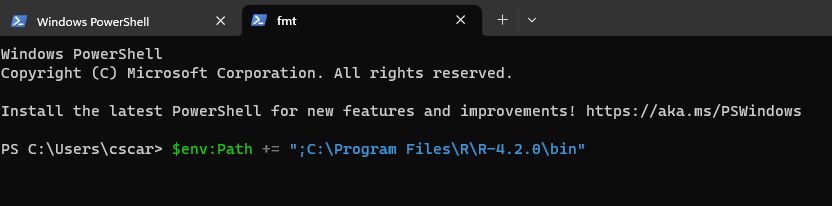
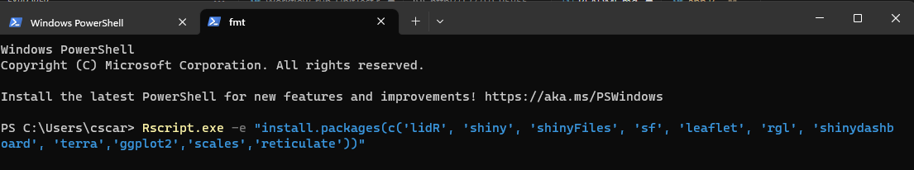
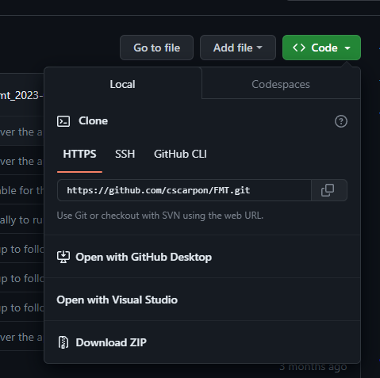
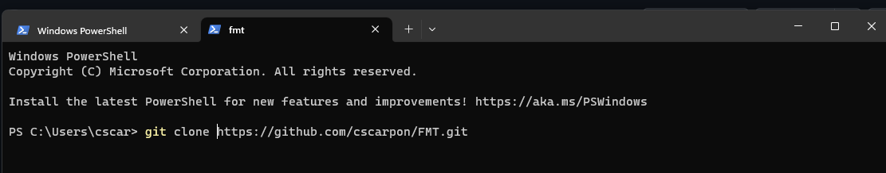
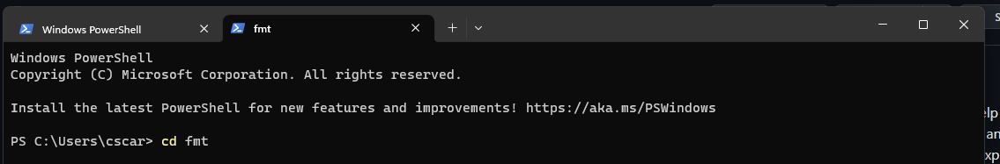
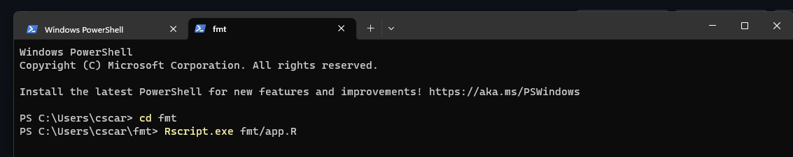

# Forest Monitoring Tool (FMT)
A Lidar Tool that is designed to help foresters, scientists, citizen scientists, and anyone who is curious enough to explore.

The tool combines most pre-processing, processing, and post-processing procedures for any point cloud, raster, and shapefile data in the click of a few buttons.

Tools and Function: The following tools and data pipelines allow for the easy performance of complicated tasks. Users can also plot and interact with their data. (exploratory data analysis). 

Tools:

Pre-processing (Pipelines in the form of Tools):

Point Clouds
- Can provide transformations on both .las and .xyz (Most programs cannot use xyz files and can only use .las, ironically, ICP alignment can only use xyz files.)
- Transforming point clouds by CRS (.xyz, .las)
- Aligning point clouds with ICP Alignment
- Creating tight hulls,
- Ground classification
- normalization of point clouds (removing the ground heights, so that only trees are exposed).
- Validating point clouds

Rasters
raster resampling and alignment,
clipping,
mask generation,
raster validation for alignments

.shp,
Transforming,
Clipping,
Validating data,
unioning

Other inputs:
.json, .geojson, whatever I want really

Processing:

Point cloud differencing (I think I figured out how to do this with the Python Package that does the alignment),
Raster Differencing,
Canopy Height models,
Classification of rasters,
raster classification statistics

Post Processing:

Saving .laz, .xyz, .las
Mapping

## Windows Installation

The FMT is currently built in Windows 11. 

To get started with the tool, you will need to download:

1. [Download base R from a mirror closes to you](https://cran.r-project.org/mirrors.html)
2. [Download the most recent version of RTools](https://cran.r-project.org/bin/windows/Rtools/)
3. [Download Windows Powershell if you do not have it](https://learn.microsoft.com/en-us/powershell/scripting/install/installing-powershell?view=powershell-7.3)

You might need to restart your computer at this point for Windows to recognise these downloads.

## Powershell

Powershell is similar to the terminal which allows command line inputs which is how we are going to install the app, install the libraries required for the app, and how we will also run the app.

Windows requires that you set `PATH` variables to let Windows know where a program's executable `.exe` file is. You can permanently set these, are you can temporarily set it. Currently, we are going to temporarily let Windows know where R is if it has not found it.

1. In the Powershell type `$env:Path += ";C:\Program Files\R\R-4.2.0\bin"` Change the version number to the one for the most recent R build on your computer.
   
 

2. This line will tell Windows to download the relevant packages: `Rscript.exe -e "install.packages(c('lidR', 'shiny', 'shinyFiles', 'sf', 'leaflet', 'rgl', 'shinydashboard', 'terra','ggplot2','scales','reticulate'))"`

3. We can clone the repo to our local drive. Select the green "Code" button and select the HTTPS URL. 

4. Paste that code into the terminal type `git clone [fmt/url]`

5. Now change directory `cd` to the newly downloaded repo `cd fmt`

6. Run the app

`Rscript.exe fmt/app.R`

``

## Docker

The image and container are made, debugging on JS react values in Chrome
## Server Usage

In the progress of building and deploying. 
