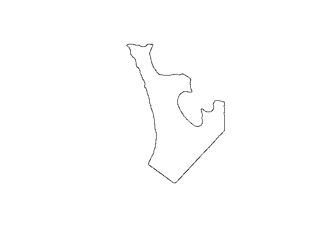
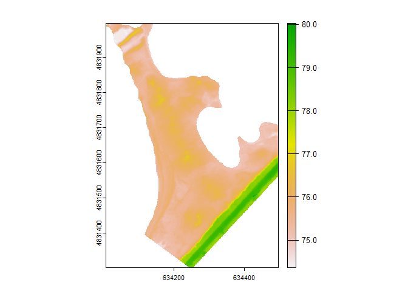
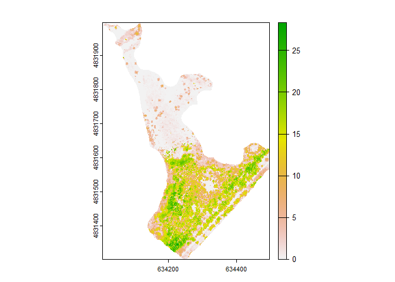
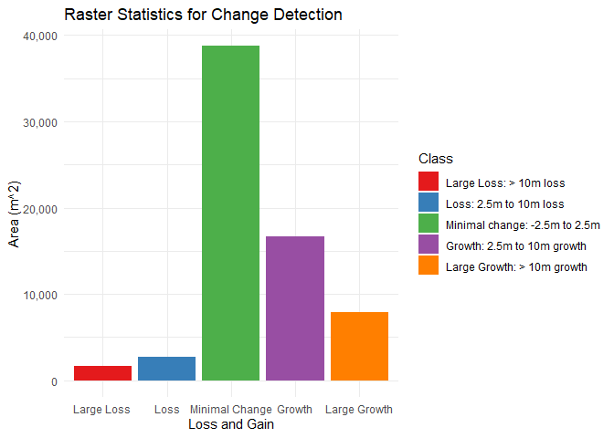

Change Detection Workflow
================

## Running the dependancy scripts

These scripts will connect the class, the functions and the global
variables to the app.

## The Meta Data Object - mo

This object is intended to read and generate metadata information to be
used for record keeping and cataloguing of the data.

needed shortcuts for vscode : press Ctrl+Shift+V in the editor. You can
view the preview side-by-side (Ctrl+K V) Ctrl+Shift+P Open Preview to
the Side

``` r
dir <- paste0(wd,"/data/")
mo_dir <- mo$new(dir)
print(mo_dir$metadata)
```

    ##   id                                          file_path             file_name
    ## 1  1 C:\\Users\\cscar\\FMT\\data\\TTP_2014_decimate.laz TTP_2014_decimate.laz
    ## 2  2 C:\\Users\\cscar\\FMT\\data\\TTP_2019_decimate.laz TTP_2019_decimate.laz
    ##   size_mb ext creation_date
    ## 1    0.91 laz    2024-04-20
    ## 2    2.77 laz    2024-04-20

## Class Structure of the Point Cloud Object

The Class structure for the point cloud object can hold a df, las, CHM
(SpatRaster), DTM (SpatRaster), mask (sfc), filepath (character),
filename (character)

spatial_container \<- setRefClass( “spatial_container”, fields = list(
xyz = “data.frame”, LPC = “LAS”, CHM = “SpatRaster”, CHM_raw =
“SpatRaster”, DTM = “SpatRaster”, DTM_raw = “SpatRaster”, mask = “sfc”,
filepath = “character”, filename = “character” )

## Reading the Class Methods

The following function `spatial_container$methods()` shows the methods
of the spatial_container class, which are inherited functions of that
object

    ##  [1] ".objectPackage" ".objectParent"  "callSuper"      "copy"          
    ##  [5] "export"         "field"          "get_data"       "get_lpc"       
    ##  [9] "getClass"       "getRefClass"    "import"         "initFields"    
    ## [13] "initialize"     "save_chm"       "save_dtm"       "save_las"      
    ## [17] "save_mask"      "save_pc"        "set_crs"        "show"          
    ## [21] "to_chm"         "to_dtm"         "to_xyz"         "trace"         
    ## [25] "untrace"        "usingMethods"

## Custom methods

to call a method use `spatial_container$method_name()`

initialize(spatial_obj, or .rdata),  
save_chm(spatial_obj$CHM, filepath) saves the currently stored CHM to the filepath, save_dtm(.self$DTM,
filepath) saves the currently stored DTM to the filepath,
save_las(path), saves the LAS object `(.self$LPC)` to your path, include
`.las` in the name save_mask(path), saves the mask `(.self$mask)` to
your path, include `.shp` in the name  
set_crs(crs), sets the crs of the current LPC to_dtm(resolution),
converts the current LPC to a DTM at the specified resolution
to_chm(resolution), converts the current LPC to a CHM at the specified
resolution, it requires that a DTM is created. It will also classify
ground if it is missing  
to_xyz(path), saves the current LPC to a xyz file at the specified path,
include `.xyz` in the name get_data(), saves the current dataframe to an
external variable get_meta(), saves the current meta to an external
variable, this is required for the ICP registration get_lpc(), saves the
current LPC to an external variable

## Running the classes and initialising the object

The object needs to be created and initialised before it can be used. It
can read either a `.rdata`, `.laz`, `.las`, or `.xyz`file. On
initialisation, an LPC object will be created regardless of the input
format

to initialise the object use `spatial_obj$new(filepath)`

    ## Warning: Invalid data: 38905 points with a 'return number' greater than the
    ## 'number of returns'.

    ## The new CRS is the same as the current CRS. No change needed.

    ## class        : LAS (v1.2 format 1)
    ## memory       : 6.3 Mb 
    ## extent       : 634008.3, 634496, 4831302, 4831996 (xmin, xmax, ymin, ymax)
    ## coord. ref.  : WGS 84 / UTM zone 17N 
    ## area         : 205086 m²
    ## points       : 137 thousand points
    ## density      : 0.67 points/m²
    ## density      : 0.48 pulses/m²

    ## Warning: Invalid data: 105851 points with a 'return number' greater than the
    ## 'number of returns'.

    ## Changing and transforming to the new CRS...

    ## class        : LAS (v1.2 format 1)
    ## memory       : 16.8 Mb 
    ## extent       : 634007.9, 634496, 4831302, 4831996 (xmin, xmax, ymin, ymax)
    ## coord. ref.  : WGS 84 / UTM zone 17N 
    ## area         : 120992 m²
    ## points       : 367.1 thousand points
    ## density      : 3.03 points/m²
    ## density      : 2.16 pulses/m²

## Functions built with the class to help the processing of Point Cloud Data, Rasters, and Shapefiles

process_raster(source, target, mask_layer, method = “bilinear”) - This
function will align rasters and resample them to the target raster. It
will also mask the target raster with the mask_layer
CHM_diff_classify(earlier, later) - This will do the differencencing of
the CHMs and reclassify them raster_stats(raster) this will produce
statistcs about the chm diff raster, it only produces area per group for
now plot_stats(stats) plots the stats of the raster to the 2D plot
consol is_empty(raster) checks to see if the raster is empty and returns
a boolean is_empty_sfc(sfc) checks to see if the sfc is empty and
returns a boolean mask_pc(pc)

## The Tight Hull mask

A tight hull encloses the point cloud data and creates a boundary that
represents the extent of the point cloud data. This is used to mask the
point cloud data to help with alignment

<!-- -->

## Creating the Digital Terrain Models (DTM)

Digital Terrain Models (DTM) are created from the point cloud data using
the `to_dtm()` method. These represent the bare earth surface. The DTM
will be saved inside the DTM slot of the class so that other instances
of the class can access it.

The DTM is created using the `grid_terrain()` function from the `lidR`
package. The `grid_terrain()` function uses a TIN algorithm to create a
DTM from the point cloud data. The `grid_terrain()` function requires a
resolution to be specified. The resolution is the size of the grid cells
used to create the DTM. The resolution is specified in the units of the
point cloud data.

    ## Warning: Interpolation of 630 points failed because they are too far from
    ## ground points. Nearest neighbour was used but interpolation is weak for those
    ## points

    ## Warning: Interpolation of 1826 points failed because they are too far from
    ## ground points. Nearest neighbour was used but interpolation is weak for those
    ## points

<!-- -->

## Creating the Canopy Height Model (CHM)

The Canopy Height Model (CHM) is created from the point cloud data using
the `to_chm()` method. These values represent the raw heights of the
trees in the point cloud data. The CHM requires the DTM, where it will
be used to subtract the elevations from the point cloud to leave the
`normalised` heights of the trees

    ## Warning: 3 points do not belong in the raster. Nearest neighbor was used to
    ## assign a value.

    ## Warning: 25366 points do not belong in the raster. Nearest neighbor was used to
    ## assign a value.

<!-- -->

## Alignment of the CHM Rasters

The rasters need to be aligned so that their extents, resolution, and
center pixels are the same. The `align_rasters()` function from the
`raster` package is used to align the rasters.

## Differencing the CHM Differences

This is a custom function created to do the difference of the CHMs and
classify the differences into pre determined bins. These values can be
adjusted in the function

<!-- -->

## Display the outputs in leaflet

This function generates a leaflet map that is then projected into the
FMT report. The map displays the DTM, CHM, CHM differences, and the mask
used to align the rasters
